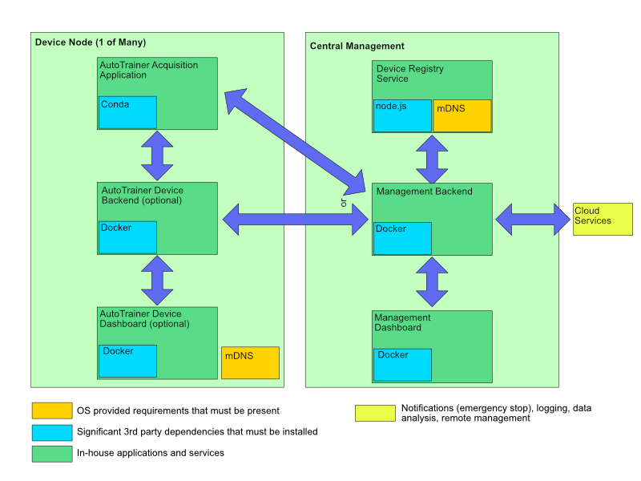

# AutoTrainer Deployment

AutoTrainer deployment involves two potential sets of applications and services
* Individual services for every device that is a node in the full system (each cage)
* Central management services that are run in a single device.
  * This device may be a separate server or one of the AutoTrainer devices.
  
## General Structure
The general structure of a deployment for each device node and a central management server is shown in the diagram below.
* Although shown as a separate device, it is possible to run the central management services on one of the devices depending on the number of devices and load
* The diagram shows the simplest layout, with all per-device services on the device node and all central management services on a single machine.  However, the only strict requirements are:
  * The Acquisition application must, of course run, on the device node
  * The Device Registry Service must be on the same local network as the device nodes

While the deployment shown has a number of distinct services, the orchestration is relatively simple and the design serves some technical and non-technical goals:
* A management console/dasboard from the local network without requiring access to the wider internet/cloud services is required in some deployments 
* Remove details of remote management, monitoring, and any external processing from the core Acquisition Application
  * Allows allocation of as many local resources and associated performance as possible to the core Acquisition Application
  * Allows for any local device application or variation of the acquisition application to be accessible without repeating those integrations
* Other than the core Acquisition Application, per-device services are generally optional or have a small feature set to build or maintain
* Integration with any cloud-based facilities occur in a single location, rather than per-device to limit credentials exposure and perform any global filtering or pre-processing
  * Various IoT frameworks seek to manage these concerns and may be a viable alternative over time.

The initial set of services do not utilize any edge device frameworks, such as AWS IoT Core/Greengrass as one example
As the system and number of deployments grow, it may make sense to take on the dependency and tight coupling of a
dedicated framework to increase functionality, reliability, and reduce development effort.

## Installation
Per-device installations instructions are described in the [device README](device/README.md).  These instructions may
reference additional requirements from other repositories.

Central console/dashboard service installation instructions are found in the [manager README](manager/README.md).

